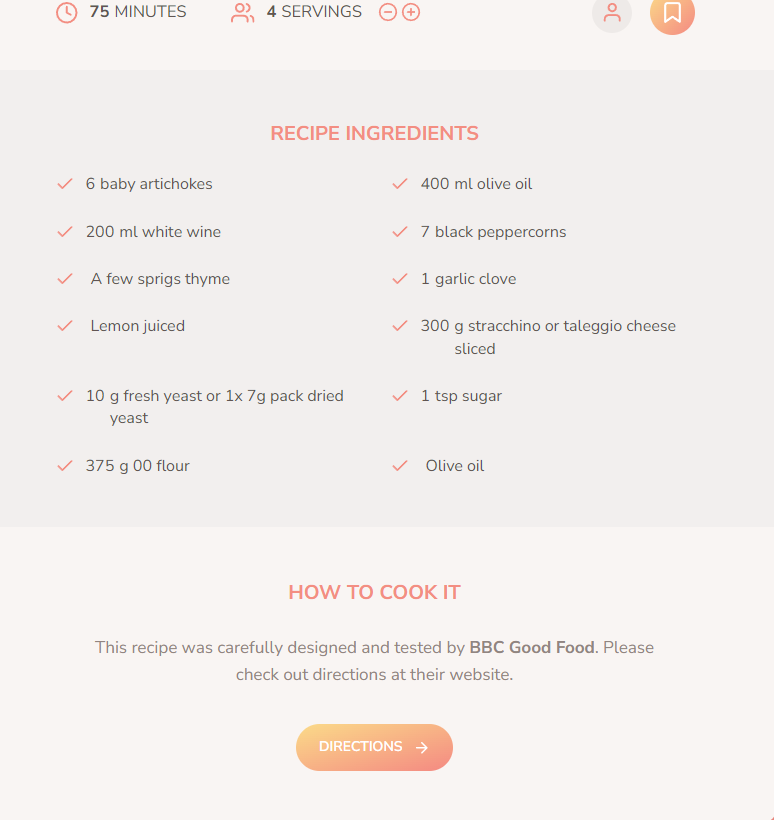

# Foodify 🍴

Foodify is a modern recipe search application where users can search for recipes, view detailed instructions, and manage their personal recipe collections. This project was built using **JavaScript**, **HTML**, and **SASS** 

## 🚀 Features

- **Recipe Search:** Search for thousands of recipes using an external API.
- **Recipe Details:** View ingredients, cooking time, and instructions for each recipe.
- **Bookmark Recipes:** Save your favorite recipes for quick access.
- **Add Your Own Recipes:** Submit and store your own recipes.
- **Responsive Design:** Works seamlessly on mobile, tablet, and desktop.

## 🔧 Technologies Used

- **JavaScript (ES6+)**
- **HTML5**
- **SASS**
- **Parcel** (for bundling and development)

## 📸 Screenshots

### Home Page

### Recipe Details

### Add Recipe

